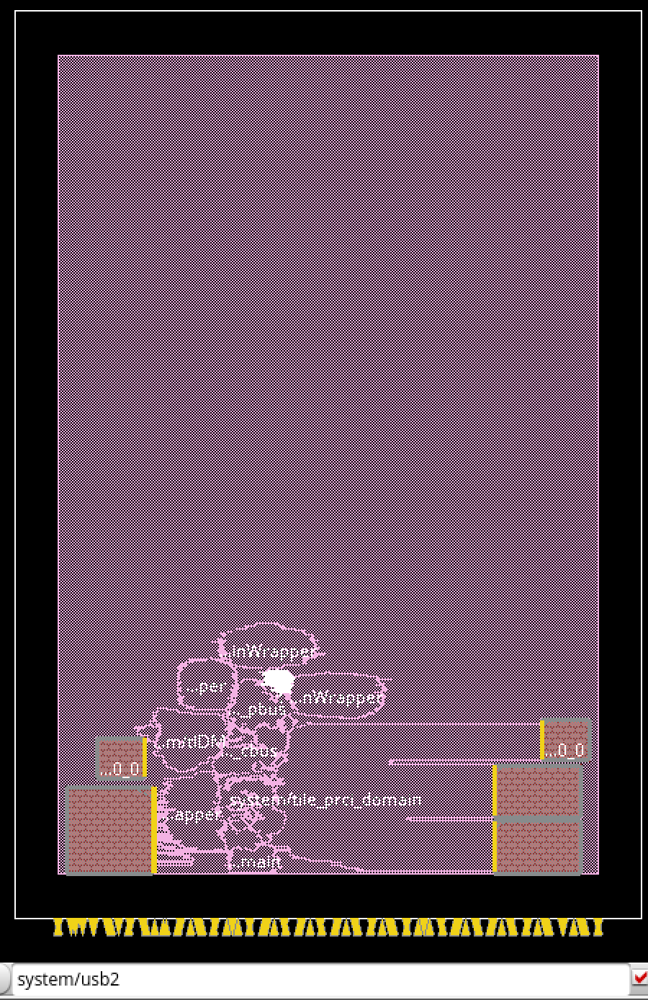

# EECS251B USB2.0 Digital Project Repository

The **Universal Serial Bus (USB)** is one of the most common interfaces for establishing communication between peripherals
and host controllers (usually a personal computer). **USB 2.0**, released in 2000, is an upgraded version of the protocol
with support for data transfer rates of **12 Mbps (Full-Speed, FS)** and **480 Mbps (High-Speed, HS)**. Access to the USB protocol allows SoCs, such as large digital CPUs, to interface with an increased variety of peripherals, such as cameras, scanners, and hard drives.

This Chipyard repository is currently the testing ground for this (as of May 10, 2024, incomplete USB generator). 
Feel free to reference the generator repository (submodule) for relevant READMEs on module status.

*USB 2.0 is real! Floorplans for motivation:*

 


## Setup

First time setup:
```
mamba activate base
git config --global protocol.file.allow always
./build-setup.sh riscv-tools -s 6 -s 7 -s 8 -s 9 -s 10 --force
source env.sh
./scripts/init-vlsi.sh sky130
conda config --set channel_priority strict
mamba install firtool
```

Next time setup:
```
mamba activate base
source env.sh
```
Sometimes (always, in some case) `mamba activate base` will tell you to run `mamba init` and open a new terminal session, which may work, but especially in tmux it's usually easiest to ignore the warning, `source ~/.bashrc` to enter (base) assuming your bash is set up correctly and `source env.sh` from Chipyard top directory from there. 

USB2.0 is set up as a generator/ submodule aptly named `usb2-generator`.
To update it to the latest commit in the other repo, run `git submodule update --remote usb2-generator` (from the generators folder). Note that `git submodule update` will *not* update to the latest commit, which may or may not be what you want.
It is advisable not to update the commit on main until it's been tested on a branch (although as of this writing May 10, USB is so buggy, every commit becomes a pull request. :3)

## To run a basic loopback test

The USB2.0 generator is set up as a tilelink node with a basic 'loopback' functionality.
To run a demonstration, execute the following:
```
cd tests
make
cd ../sims/vcs
make CONFIG=Usb2Config BINARY=../../tests/usb2.riscv run-binary
```

## Debug Notes

``mamba install firtool`` gives error right now with both mamba and conda.
``The following package could not be installed``
``└─ firtool does not exist (perhaps a typo or a missing channel).``
- note that Chisel 3 is being used in build.sbt, would not be issue in Chisel 6
- but if you ignore this eventually you just forget you had this issue

Uh oh, ``/chipyard/vlsi/macros/sram22_64x32m4w32_macro/sram22_64x32m4w32_macro_tt_025C_1v80.rc.lib is not a file or does not exist``?
- Make sure to remove srambist from the design.yml! And the external library references at the bottom of sky130.yml.
- If you're seeing this README, this should not be an issue on this branch (already done).

How do I run PAR with Chipyard?
- In the `vlsi` folder: `make CONFIG=... par` i.e. `make CONFIG=Usb2Config par`
- Note that the average successful Usb2Config PAR right now has been 3-4 hours (from little data points)
